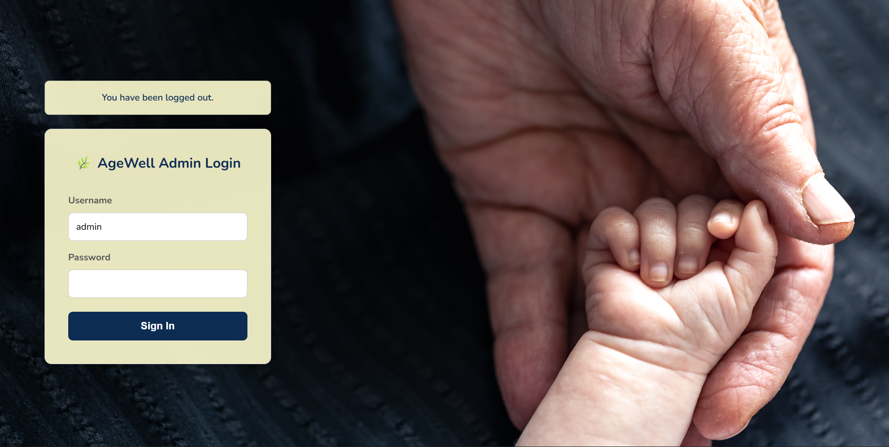
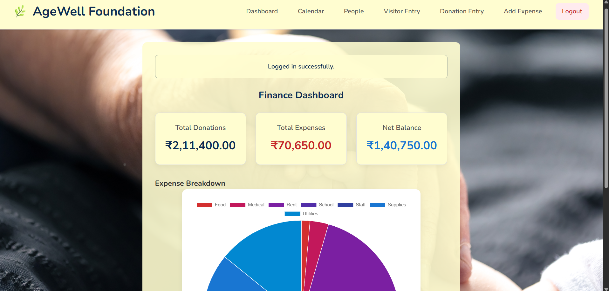
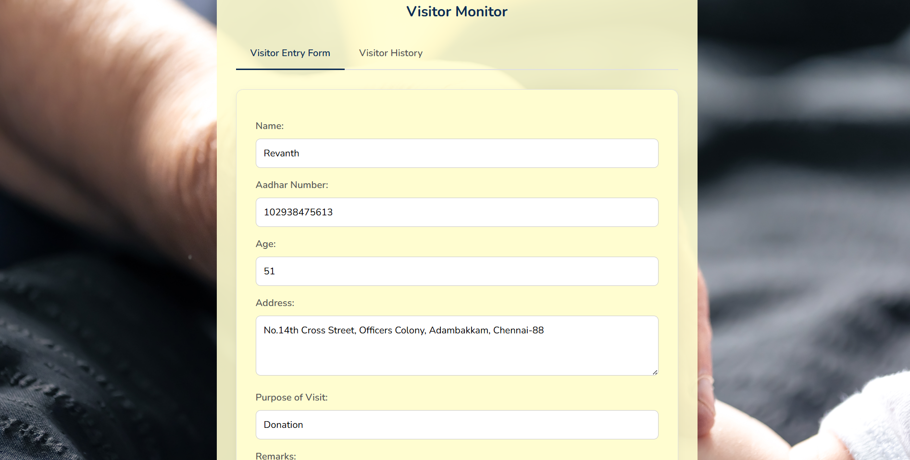
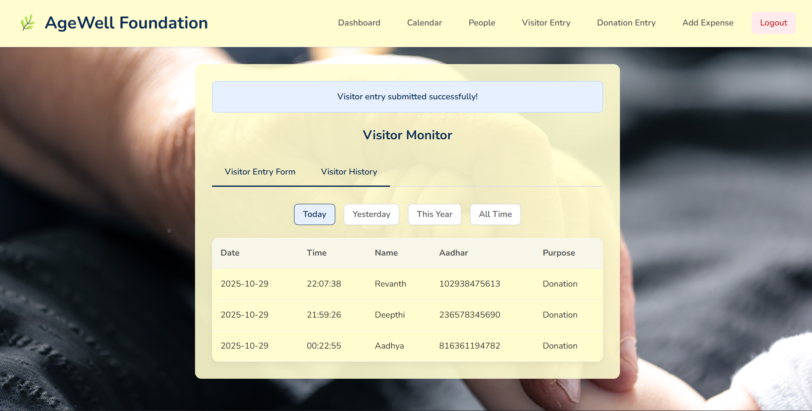
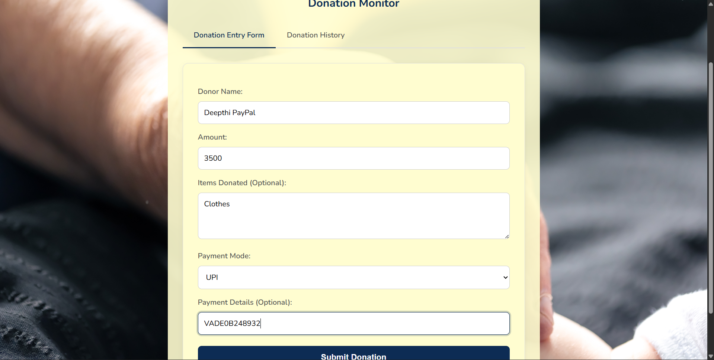
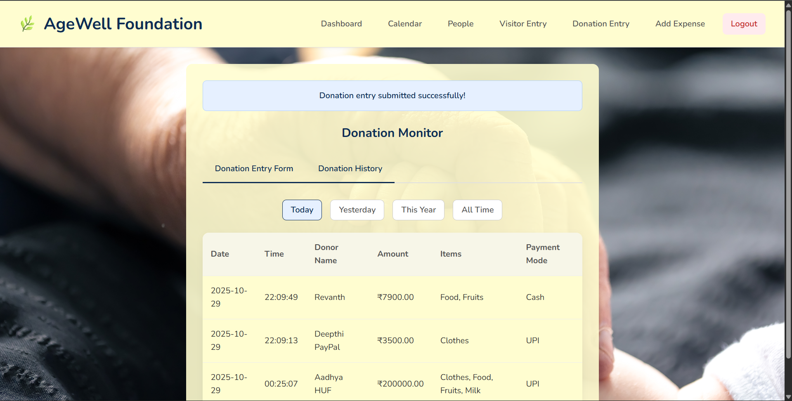
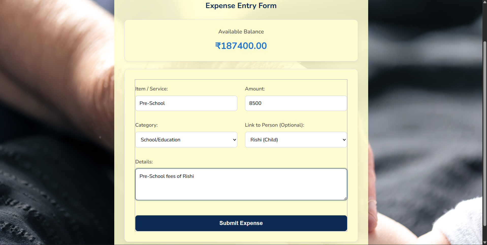
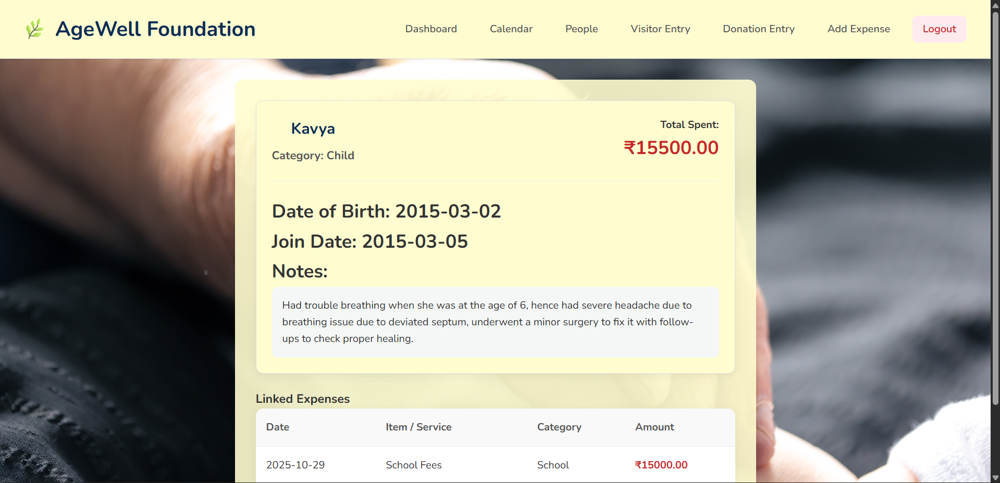
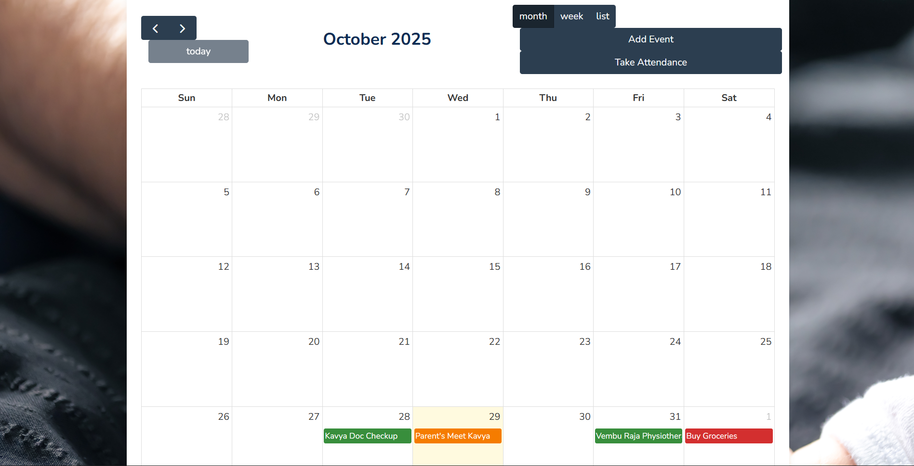

# 🌿 AgeWell Admin Portal

**AgeWell Admin Portal** is a lightweight **Flask + SQLite3 web app** for small NGOs and orphanages to  
securely **record visitor details and track donations** in one place.

---

## Features

### 🖥️ Admin Portal
- Admin sign-in and sign-out
- Simple navigation header with **Dashboard**, **Calendar**, **People**, **Visitor Entry**, **Donation Entry**, **Expense Entry**
- Unified success page confirming submissions
- Works out of the box with no external database server


  
### 🧑‍🤝‍🧑 Visitor Management
- Capture **Name, Aadhaar number, Age, Address**
- Store **Purpose of Visit**, optional **Remarks**, and automatic **visit date**
- Data saved in the `visitors` table inside `goodlife_schema.db`



### 💝 Donation Tracking
- Record **Donor Name**, **Amount (₹)**, and **Items Donated**
- Choose **Payment Mode** (Cash / UPI / Bank Transfer)
- Optional **Payment Detail** (UPI ID or Bank Ref) shown dynamically
- Auto-records **donation_date** in the `donations` table



### 🧑‍🤝‍🧑 Finance Management
- Records the day-to-day expense
- Displays a pie-chart to display the amount spent
- Helps tally the amount spent and check on current balance
- Maps the purpose of the expense
- Maps to the people money spent on


### 🧑‍🤝‍🧑 People Management
- List of the people in the NGO (staff, abandoned kids and elders)
- Track the expense of each person and purpose
- Contains their personal details
- Holds health records of them


### 🧑‍🤝‍🧑 Appointment and Attendance
- To keep track of their attendance
- Mark important events (Doc Appointment, School Meeting, Purchase of groceries, etc.)
- Mark urgency with colour code based on the type of event (Green, Yellow, Red)

---

## 🛠 Tech Stack
- **Backend Framework**: Python (Flask)
- **Database**: SQLite
- **Frontend Structure**: HTML5
- **Frontend Styling**: CSS3 (Custom styles for layout, theme, and 
backgrounds)
- **Frontend Interactivity**: Vanilla JavaScript (for tabs, modals), Chart.js (for finance dashboard), FullCalendar (for calendar)
- **Authentication**: Flask-Login 

---

## 🚀 Getting Started

### 1️⃣ Clone the Repository
```bash
git clone https://github.com/ShreyaVijaykumar/AgeWell-Admin-Portal
cd goodlife-foundation
```

### 2️⃣ Install Dependencies
```bash
pip install flask
```

### 3️⃣ Run the App
```bash
python app.py
```
- Visit **http://127.0.0.1:5000/ or corresponding port**
- The SQLite database goodlife_schema.db is created automatically.


